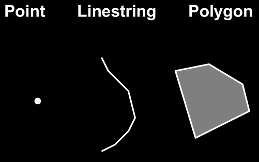
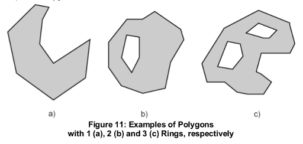
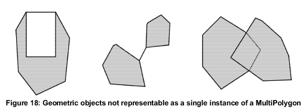
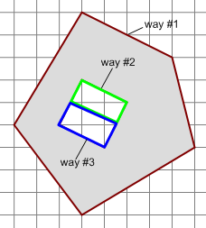
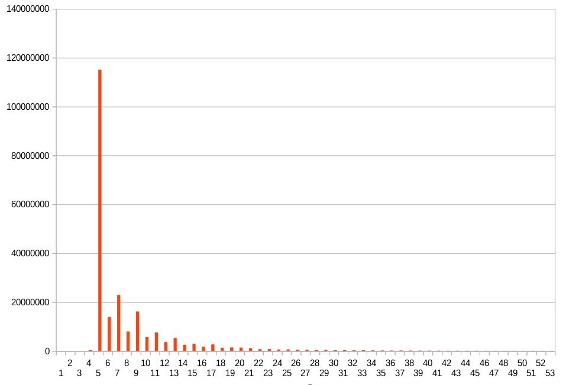

# Polygons in OSM

Usual geographic information systems (GIS) understand three different kinds of geometric objects: points, linestrings, and polygons. Points and linestrings are easy to understand and use, but polygons can be complex and difficult to understand objects. In the often used [Simple Features](https://en.wikipedia.org/wiki/Simple_Features) definition a polygon can have one outer (or exterior) ring defining the outer border of the polygon and zero or more inner (or interior) rings. Inner rings are used for holes inside the polygon. Think *lake in a forest* or *courtyard in a building*. Having the option to model those holes is important. A courtyard in a building is not just a green area drawn on top of a brown area hiding what's underneath. To calculate, say, the footprint area of a building, you need to subtract the area of the courtyard from the area defined by the outer border of the polygon.

*Example polygons from Simple Features definition*

## Multipolygons

A multipolygon is basically just a collection of polygons. A multipolygon can have several outer rings, each can have zero or more inner rings. Multipolygons are useful for areas like "the United States" (think Alaska, Hawaii, and all the small islands off the coast) or a national park that is split up into several pieces. Multipolygons say: This is one national park with several disjunct areas. Several polygons (maybe with the same attributes) would say: These are several national parks that happen to have the same name. Clearly the former is what you want to have.

*Example multipolygons from Simple Features definition*

Just as there is the concept of a multipolygon, there are the concepts of multipoints and multilinestrings. But they are generally less important and don't play a role in OSM. (Although you can think of hiking routes or public transport routes as multilinestrings.)

## Winding order

Some, but not all algorithms, programs, and standards define a winding order for polygon rings. The winding order says in what order the points in the polygon rings are ordered when "looking from above", clockwise or counter-clockwise. The most important part is that the winding order of the outer ring(s) is counter to the winding order of the inner ring(s). The algorithm for calculating the area of a polygon, for instance, depends on that. But other algorithms or programs are stricter. Being strict about the winding order means that more programs can rely on this, often allowing simpler algorithms to be used or an expensive check to be avoided.

Note that the winding order depends on the coordinate system used, the OSM WGS84 coordinates start from the lower left (-180°, -90°) and go to the upper right (180°, 90°). Simple Features says that outer rings have to be counter-clockwise, inner rings are clockwise. But Mapbox vector tiles, for instance, use [Web mercator and the Google tile scheme](https://github.com/mapbox/vector-tile-spec/tree/master/2.0#3-projection-and-bounds) where coordinates are numbered from the top-left (0,0) to the bottom right. So they Y-coordinate is flipped, which means a counter-clockwise polygon from OSM transformed into vector tiles will appear clockwise there! Consequently Mapbox vector tiles define the [outer rings to be clockwise](https://github.com/mapbox/vector-tile-spec/tree/master/2.0#4344-polygon-geometry-type).

For some more details see [this stackexchange question](https://gis.stackexchange.com/questions/119150/order-of-polygon-vertices-in-general-gis-clockwise-or-counterclockwise).

## Validity

*Examples of invalid polygons and multipolygons from Simple Features definition*

Not all "things" you can build with outer and inner rings will lead to a "proper" polygon or multipolygon. It is obvious that overlapping rings (outer or inner) are not allowed for instance. But there are other rules that are not so easy to understand (and get right). There are many rules in the Simple Features definition that define what is and what isn't a valid (multi)polygon. These rules help to make sure that there is only one way a (multi)polygon can be modelled and they help the algorithms to be more efficient and correct. The rules in the official definition might be mathematically precise, but they are hard to read. Here are some of those rules, somewhat translated:

* No intersections of any rings are allowed.
* The interior of a polygon is connected.
* Rings of a polygon can only touch in a single point, not in several points, and not along a line.
* No spikes.

There are subtle differences in definitions of validity, but we are going with the Simple Feature definition and its implementation in [GEOS](https://trac.osgeo.org/geos/), because it is very widely used in the Open Source world. If you ask PostgreSQL, for instance, whether a polygon is valid or not, this is what it will report. If you want to dig deeper read the paper ["About Invalid, Valid and Clean Polygons" (PDF)](http://www.springer.com/%3FSGWID%3D5-102-45-124048-p32597622).

## Polygons in OSM

Unlike basically all other GIS systems, OSM doesn't have a polygon or multipolygon data type. Instead other data types are used to "simulate" a polygon. This makes working with OSM data complicated, but it is the way things are.

There have been some efforts to create a real (multi)polygon object type in OSM, but they have never amounted to much. There is a lot of disagreement about how such a data type would look and introducing it would lead to a major reengineering effort for a lot of the OSM software. There is a [wiki page in the OSM wiki](https://wiki.openstreetmap.org/wiki/Area/The_Future_of_Areas) collecting all the different ideas. And I gave a talk at the SotM 2013 called "Towards an Area Datatype for OSM" on this topic ([slides](https://media.jochentopf.com/media/2013-09-08-talk-sotm2013-areas-en-slides.pdf), [video](https://media.jochentopf.com/media/2013-09-08-talk-sotm2013-areas-en-video.mp4)).

So how to polygons in OSM look? There are several ways to model a (multi)polygon used in different circumstances. For simple cases a *closed way* is used, for more complex cases a *multipolygon relation*. And then there are two different special cases, one for [coastlines](https://wiki.openstreetmap.org/wiki/Tag:natural%3Dcoastline) and one for [rivers](https://wiki.openstreetmap.org/wiki/Tag:waterway%3Driverbank) which, in the end, also describe multipolygons, but I will not go into these here.

## Closed ways

Ways forming a closed ring with the first and last node being identical can be polygons depending on their tags. They can't have holes and they can't be multipolygons. But they can be seen as a simple polygon with just one outer ring.

There is no generic way to find out whether a closed way is a polygon or not. You have to look at the tags. A closed way tagged `highway=primary` (think *roundabout*) is not a polygon, a closed way tagged `landuse=forest` is a polygon. A closed way tagged `highway=primary` **and** `landuse=grass` is both, think of a roundabout with a grassy knoll in the middle. Those double-use ways don't appear often, but they exist and have to be handled. Every closed way that isn't a polygon can be made into a polygon by adding the tag `area=yes`. So a closed way tagged `highway=pedestrian` and `area=yes` describes something like a plaza or city square. Conversely you can tag `area=no` on something that might look like an area to turn it into a linear feature, but this tag isn't used very often.

## Multipolygon relations

Relations are multi-purpose data types used for all sorts of things, including turn restrictions and public transport routes. But by far the most common use is for (multi)polygons. As soon as a closed way is not enough to describe an area feature, a relation must be used. A [multipolygon relation](https://wiki.openstreetmap.org/wiki/Relation:multipolygon) has one or more way members, each describing one ring or part of a ring. The ways have to be "stitched together" to form the actual rings. Then the rings have to be assembled into the the final (multi)polygon. Note that the name "multipolygon relation" can sometimes be confusing, because simple polygons (with or without holes) can also be modelled by such a relation. Just see the polygon as the special case of a multipolygon with just one outer ring and it all makes sense.

When we are talking about multipolygon relations, we are actually talking about two different types of relations. There are those tagged [`type=multipolygon`](https://taginfo.openstreetmap.org/relations/multipolygon) and those tagged [`type=boundary`](https://taginfo.openstreetmap.org/relations/boundary). Relations tagged `type=boundary` are a special case, they are used for boundaries (country, state, city, national parks, etc.). I used to argue that they just use the `type=multipolygon` tag, too, because geometrically they describe the same thing, a multipolygon, but I have lost that battle. Most boundaries are tagged this way, but you see both uses. For our purposes here we'll treat the two different relations types the same.

There are several common reasons why relations are used instead of the more simple closed ways:

* The polygon has a hole. [Example: A building with courtyard.](https://www.openstreetmap.org/relation/5789)
* We need a multipolygon with several outer rings. (Example: Complex city boundary with exclaves.)
* The (multi)polygon is very large. Ways can not contain more than 2000 nodes. And even smaller ways than that can become unwieldy. Longer rings can be split up into parts that might be easier to handle. (Example: Large bodies of water.)
* The ways forming the rings can be part of several adjoining (multi)polygons. The ways can be re-used as members in all those multipolygon relations. (Example: County borders where each county directly borders on the neighbours.)
* Ways can do double duty as part of one or more rings and have tags on their own. (Example: Way is part of a polygon describing a parking lot and has tags that show the way as a wall going around (part of) the parking lot.) This use is contentious as it often makes working with the data difficult. Most mappers seem to create two (more or less parallel) ways in instances like these today, but this is still seen quite often.

## Relation members

Each way member of a multipolygon relation has a role, which should be either `outer` or `inner` to mark to which type of ring a way belongs. But this role is often wrong (inner/outer switched), just empty (over 50,000 roles in current planet), or something [totally different](https://taginfo.openstreetmap.org/relations/multipolygon#roles). For boundaries roles `exclave` and `enclave` were sometimes used instead of `outer` and `inner`, but this use is now mostly gone.

Because the roles are so unreliable, typical software assembling multipolygons (such as Osm2pgsql and Osmium) will therefore ignore the role and just try to do the right thing looking at the geometry and figuring out for itself what is outer and what inner. But this is only possible if you have the complete multipolygon data. If you only have a part of it, for instance while editing a larger polygon in your editor where you downloaded only some of the data, the roles can still be important to show the polygon correctly.

Usually multipolygon relations should only have members of type `way`. But sometimes they have other members, such as nodes with role `admin_centre`, or `subarea` relations, or `label` nodes. This is mostly used on boundary relations. I am not aware of any software that actually uses these, but I imagine there might be some. Usually this is only a problem when mappers think they can build "stacks" of multipolygon relations containing other relations and that we somehow assemble multipolygons from these complex objects. See these graphs for [type=multipolygon](https://taginfo.openstreetmap.org/relations/multipolygon#graph) and [type=boundary](https://taginfo.openstreetmap.org/relations/boundary#graph) role use.

Relation members should be in some order forming closed rings, but this is not always the case. There is no expectation what the winding order is or that inner rings should come after their outer rings. This is also something any multipolygon assembly software has to fix by themselves.

## Interpreting tags on the relation and members

For closed ways it is easy to see what tags the multipolygon should have, it just has the tags of that way. But for multipolygon relations this is more difficult. We differentiate between two different kinds of tagging sometimes named "old style" and "new style":

For *new style* tagging all the pertinent tags are on the relation. So the multipolygon gets all the tags from the relation (possibly minus the `type` tag which is redundant now that the information is a multipolygon is already "used"). The tags of the member ways don't matter at all for **this** multipolygon. There might be other (multi)polygons built from (some of) the same ways, either if they are closed or if they are members of additional multipolygon relations.

For the *old style* tagging the relation doesn't have any tags, instead the tags from the outer way or ways are used for the multipolygon. The tags of the inner ways are ignored (but could be used to create additional (multi)polygons if they are closed ways or part of different multipolygon relations). If the outer rings are formed from more than one way, the common set of tags from those ways is used for the multipolygon. Implementations of the details differ, but usually you remove some "uninteresting" tags such as `created_by` and `source` and compare the rest of the tags. If they are the same, use that set of tags, if not the multipolygon is invalid.

The *new style* tagging option is the recommended tagging option these days, more than 90% of the multipolygon relations are new-style. The *old style* tagging option is problematic for multiple reasons: First it is somewhat ambiguous, because just looking at a way you can't tell whether this way is part of a multipolygon and has to be handled differently. And keeping tags synced between multiple outer ways is also difficult. But there are 260,000 multipolygon relations without tags out there. This is one problem we are trying to solve.

There is a further complication: Sometimes mappers have not only put the multipolygon tags on the outer ways, but on the inner ways, too. If this is the case, we have to treat those ways as untagged. Otherwise we might, say, fill in a forest clearing with another forest polygon. There are about 17,000 cases of this on the planet currently. These have to be fixed, too.

Note that it is important to look at the multipolygon relations first and handle them before closed ways are handled. If you have a closed way that is the single member of a multipolygon relations (there are about 100,000 of those), you have to handle them *only* as the multipolygon members, not as *closed way*. And note also that to do all of this really correctly, you have to assemble **all** multipolygons first regardless of whether you are interested in them and only then look at the tags to decide whether you are actually interested in them. Otherwise you might get different results, for example when there is a closed way with tags that interest you in a relation with tags that don't interest you. This also means that you can not just interpret closed ways and leave interpreting multipolygon relations for later, because you will not only miss some of the data, you will interpret some of the data in the wrong way. So first create all multipolygons, then filter out what you don't need.

After reading about all these complicated stuff, you see why getting rid of *old style* tagging is important. Without it, things become very easy: Just look at the tags of the closed way and the tags of the multipolygon relation. Each object can be handled by itself.

## Touching inner rings

There is a special case used in OSM tagging that is not allowed by the Simple Features definitions: Inner rings touching along a border. Think of a forest (way #1) with a clearing. The clearing contains a meadow (way #2) and a lake (way #3). The correct modelling of such a scenario would involve one multipolygon for the forest with an outer ring and an inner ring that goes around the meadow and the lake. And then two polygons for meadow and lake, respectively. But in OSM the meadow and lake can both be tagged as inner. It is the job of any software assembling the multipolygons to detect that the inner polygons have a common border and join them to form the inner ring of the forest multipolygon.

## The Antimeridian

Polygons crossing the [antimeridian](https://en.wikipedia.org/wiki/180th_meridian), the 180° line from the North Pole through the Pacific Ocean to the South Pole, are a problem. Most software can not handle it correctly. And without a winding order it is impossible to get this 100% right. If you think about it: This little square polygon on the map showing my house, it could also be interpreted as "everything on the planet except my house". How do you know which side is inside and which is outside? The winding order could make this clear, but OSM doesn't have that.

So OSM pretends that the earth is flat and doesn't have polygons crossing the antimeridian. That's why there is a [seam in Siberia](https://www.openstreetmap.org/#map=5/67.153/179.121). This is not a perfect solution, but it is rather practical. Unless you live near the antimeridian or want to use the data from there...

And while we are talking about the "edges" of the world. A polygon surrounding one of the poles will also likely not work properly. Just don't map anything like it and we can keep pretending the world is flat.

## Assembly software

As you saw from all the details above you can not use the OSM polygons as easily as you can use OSM nodes or OSM "linear" ways. Instead you need some piece of software that assembles the pieces into (multi)polygon geometries and decides which tags those multipolygon geometries should have. There are multiple independent implementations of this assembler around. The most important one currently is the one in [Osm2pgsql](https://wiki.openstreetmap.org/wiki/Osm2pgsql), because it decides what appears on most OSM-based maps. If some multipolygon is tagged in a technically wrong way but Osm2pgsql accepts it, then that is good enough for most mappers. By default Osm2pgsql will not discard invalid polygons, it will try to fix them (using a `buffer(0)` GEOS operation), which mostly works. So Osm2pgsql is very lenient, maybe more so than other assemblers. If we can get most of the invalid multipolygons fixed, we can switch Osm2pgsql to just ignore them. This will make it much faster, and mappers will see immediately on the main map if their data is wrong and correct it. (Osm2pgsql is currently moving in that direction, the next version will not repair many of the broken geometries any more.)

## Closing

There are currently about [2 million relations tagged `type=multipolygon`](https://taginfo.openstreetmap.org/tags/type=multipolygon) and about [400,000 relations tagged `type=boundary`](https://taginfo.openstreetmap.org/tags/type=boundary) containing together about 16 million way members and 280 million nodes. But there are many more closed ways. Of the about 350 million ways, about 230 million are closed ([db stats](https://taginfo.openstreetmap.org/reports/database_statistics)) containing together about 2.4 billion nodes. Most of those ways are tagged [`building`](https://taginfo.openstreetmap.org/keys/building) (190 million). Other popular polygon keys are `landuse` and `natural`.

Most of the buildings are rectangular and contain just 5 nodes (4 corners and the last node is the same as the first). You can see it in the image above. It shows for each node count how many closed ways there are. Note the interesting "odd" pattern there. But there are also huge polygons. The largest is the Island of Great Britain containing somewhat over 640,000 nodes. Of course if you look at the area, there are much larger polygons, but Britain seems to be mapped in much more detail. Altogether there are 54 multipolygons with more than 100,000 nodes. So any software has to handle a huge range of different sized (multi)polygons efficiently.

