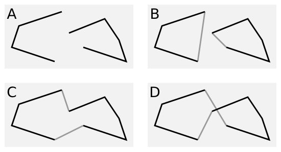

# Frequently Asked Questions (FAQ)

## What exactly is the problem?

There are really two problems here. First there are lots multipolygon relations
tagged *old style* with the tags on the outer ways. And then there is the
problem of broken data leading to invalid geometries, polygons with
self-intersections for instance.

Read the [background documentation](background.md) for all the details.

## But why is this a problem?

(Multi)polygons are one of the fundamental geometric objects and they are used
to describe everything from small playgrounds to the area of entire countries.
Getting a polygon wrong can have consequences, the most obvious one is the
**visual impact on the map**. Sometimes this is just a small parking lot
missing entirely, but it could be much larger. Because of some inner/outer
mixup in the tagging of a lake, a whole town could suddenly appear submerged,
for instance. Especially when we think about country borders appearing in the
wrong places, this could lead to problems.

Bad multipolygons can also **impact the geocoder**. Address search has to known
in which country or city a street is. Bad polygons might not be easily visible
on the map, but addresses could be found in a neighboring county or not at all.

Then there is the problem bad data has on lots of **geographic algorithms**.
Simply calculating, say, the forested area of a country can go badly wrong when
multipolygons are mapped in the wrong way, even if they appear fine on the map.
This can also affect simplification or generalization algorithms. Because many
algorithms depends on the formally correct modelling of the data as valid
multipolygons, data might need to be corrected before use, which can be quite
expensive. Osm2pgsql for instance checks all multipolygons for validity and
calls [`Buffer(0)`](http://postgis.net/docs/ST_Buffer.html) if they are not
valid. Both operations are really expensive compared to just assembling the
multipolygons.

There is also the **cognitive burden** on the mapper who is working on the OSM
data in an editor. Instead of concentrating on the task at hand, they have to
figure out why a polygon does or doesn't work, or where in the multiple
possible places (relation or member ways) they have to change some tags to get
the desired effects. This can get hugely complicated when many (nested)
(multi)polygons are involved.

The worst offenders are the *old style* multipolygons where tags are on the
outer way(s). The whole approach to assembling multipolygons is greatly
affected here. Instead of taking each OSM way on its own and either render it
or not depending on its tags, we always have to check **all** multipolygon
relations first, to check that the way is in none of them. Only then can we
render the way. This has a huge **impact on the scalability** of OSM data
processing. All of this is made worse, because we also want to process updates
in a timely manner. But even a tiny change, a node moving, or a tag on a way
changing, can impact huge multipolygons in multiple ways.

## Are we talking about *polygons* here or *multipolygons*

We are always talking about both. A polygon is just a special form of a
multipolygon with just one outer ring.

Read the [background documentation](background.md) for all the details.

## Are we talking about areas created from closed ways, too, or just multipolgyon relations?

Both. Only multipolygon relations have the problem with the *old style* tagging,
but the problems with invalid geometries also affect closed ways.

## What are *old style* multipolygon relations?

[Multipolygon
relations](http://wiki.openstreetmap.org/wiki/Relation:multipolygon) can be
tagged in two ways. The preferred and most common way is to put the tags for
the (multi)polygon on the relation. The *old style* puts tags on the outer
way(s) instead.

## What about boundary relations?

Relations tagged `type=boundary` typically used for administrative boundaries
behave in many aspects like multipolygon relations. (Because, after all, they
define the area of a city or country or so, which is a (multi)polygon.) So we
need to have a look at these, too.

## What are we doing about it?

This is a large effort and the contributions of many people are neede to do
all this. Here are some things we are doing or planing to do:

* Write documentation that explain how to best tag (multi)polygons.
* Write new tools and enhance existing tools to detect problematic
  (multi)polygons and bring this information to the mapper.
* Create statistics to track progress.
* Actually fix the (multi)polygons manually.
* Maybe write software to fix (some of) the polygons automatically.

## Who is doing all this?

You are. Well, we hope you will be helping. This is a larger effort that needs
everybodys help. We need mappers to actually fix the data. But before they can
do that, we need to create new tools or extend existing ones that help find the
problematic cases and help fixing them. We can also use support from editor
developers. If you think this is a worthwile project, get involved.

## Can't we live with the wrong data and fix things in post-processing

OSM data has always problems and many data users have done more or less complex
processing of the OSM data before using the data. This includes fixing
(multi)polygons. But this is (computationally) expensive to do, not always easy
and sometimes ambiguous. As in the image above, for instance, it might not be
clear how to close the open rings of a (multi)polygon (A). Is (B) the right
choice or (C)? Or do we decide on (D), create an intersection and make the
problem worse?

## Can we fix the OSM data automatically or do we have to do it manually?

There might be some cases which can be fixed automatically if the cases are
simple and the fix obvious. It might be possible to fix some cases that
are from imports. But it is really difficult to write a program that does
this properly and we have to take the [automated edits
guidelines](http://wiki.openstreetmap.org/wiki/Automated_edits) into account.
We have to explore this further and will maybe start discussions around fixing
some particular cases automatically.

But the majority of cases will have to be fixed manually after a mapper looked
a each case and determines the best course of action.

## How long is this all going to take?

We don't know that yet. Currently we are at the beginning of this effort and
there is a lot to do. We are certainly talking about months here.

## Will we ever finish this effort?

Of course there will never be a time, when OSM data including all polygons is
perfect. Our goal is to get rid of the *old style* tagging completely and
reduce the number of geometrically invalid (multi)polygons so far, that the
map will look okay, even if geometrically invalid (multi)polygons are ignored.
This goal is, of course, somewhat imprecise. Over the course of the effort
we'll probably get to a better understanding of the details here.

## I have some software that handles multipolygons. What do I have to do?

The short answer is: nothing. If your software works today, it will continue to
work.

The slightly longer answer is: You can check your software and see whether it
can be simplified. Chances are that you can make your software simpler and
faster. Of course you might want to wait a bit, until more (multi)polygons are
fixed.

## I have some questions, where can I go?

See the [Contact section in the README](../README.md#contact).

