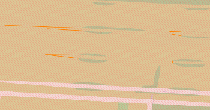
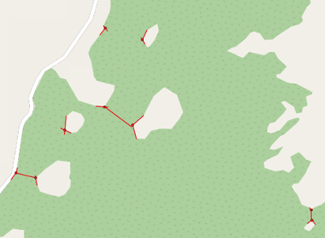
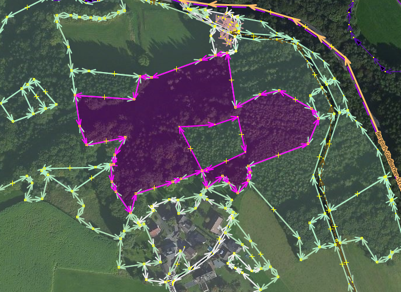
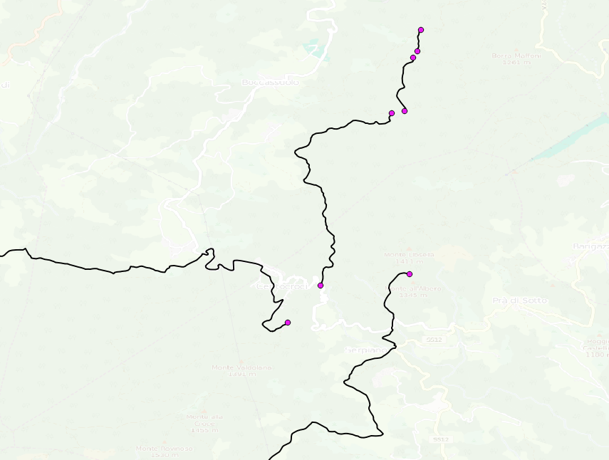
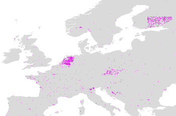

# Typical problems with OSM multipolygons

Here are some typical issues that happen with (multi)polygons.

The numbers quoted in the text below are from summer 2016. Also see the
[current statistics](http://area.jochentopf.com/stats/).

Daily updated data for these problems is available from the [`areas.db` file]
(http://area.jochentopf.com/download/areas.db) (careful, this is a huge
Spatialite database with over 1.2 GByte).

## Basic geometry problems

There are some basic geometry problems affecting multipolygons (but not just
multipolygons). Simplest are ways without any nodes or just one node. These
don't happen often any more. Sometimes there are several nodes with the same
locations. So the locations and not only the IDs have to be taken into account
when joining ways together into rings. And sometimes two consecutive nodes in a
ring either are the same nodes or are different nodes with the same location.
Those should be collapsed into a single point. Together there are about 55,000
cases on the planet.

These problems can easily be solved in post-processing, so they are not a
priority to fix in the OSM data, but they might be indicative of general data
problems or maybe some editor problem. I can't see any patterns in the
geographic distribution, so they are probably not due to imports.

Finding these cases is easy, no multipolygon assembly needed to find them.
Manual fixing is easy, automated fixes for at least some of these cases might
be possible.

* Layer `perrors` in `areas.db`, `problem` is `single_node_in_way` or
  `duplicate_node`.
* [OSM Inspector Geometry view showing single nodes und duplicates
  nodes](http://tools.geofabrik.de/osmi/?view=geometry&overlays=single_node_in_way,duplicate_node_in_way)

## Duplicate segments

There are about 60,000 duplicate segments in about 11,000 ways on the planet.
Duplicate segments are a byproduct of touching inner rings, where they are
okay. But in other cases they indicate some problem. They are often used to
create "fake inner rings" which should be fixed. Or they are spikes. Or
indicate some other, more complex to diagnose problem like in the image below.

The current Osmium code can not differentiate between problematic and
non-problematic duplicate segments. This could be improved for better
reporting to mappers what to fix.

One type of problem, the "fake inner ring", can often be detected when looking
at ways where different parts of the way end up in different rings. See the
example below which shows those ways in blue and highlights the duplicate
segments. There are about 10,000 ways like this.

* Layer `lerrors` in `areas.db`, `problem` is `duplicate_segment` and
  `way_in_multiple_rings`.

## Intersections

There are about 50,000 intersections between rings (or self-intersections) on
the planet. These cases should be fixed. Visual impact usually isn't huge, but
intersections are often indicative of some larger error in the data. Here is
an example:

* Layer `perrors` and `lerrors` in `areas.db` both contain `problem`
  `intersection`, the first marking the intersection location, the second
  the intersecting segments.

## Touching rings

Touching rings don't have to be a problem. But often they indicate some
suboptimal mapping. Sometimes they are the result of nodes snapping to (the
wrong) ways in the editor. Seeing the places where rings touch can sometimes
help find and resolve other problems. And sometimes they are the result of
imports from data that appears detailed, but is really autogenerated from
raster data and should me much smoother in reality. Often the result just look
wrong. Forests don't have sharp edges that meet at corners. Currently it is not
clear how best to identify the different cases and handle them. But there are
30,000 places where rings touch on the planet and it would be nice to use that
information to improve data quality.

Here is an example:

* Layer `perrors` in `areas.db` with `problem` set to `touching_ring`.

## Open rings

There are about 12,000 places where a ring is not closed. In some cases these
are just small gaps in a ring that could be closed automatically, but there is
no guarantee that just closing it will lead to the right solution, often the
attempt would lead to self-intersections. So these are best fixed manually.
Many of them are probably indicative of other problems, too.

* Layer `perrors` in `areas.db` with `problem` set to `ring_not_closed`.

## Inner/outer problems

There are about 14,000 ways with a member role other than `inner`, `outer`, or
empty. Some of these are just typos that could be fixed automatically, but
often the role contains some useful information, like a proper name or so. It
seems many mapper are confused about what the role is for. These have to fixed
manually.

* Layer `lerrors` in `areas.db` with `problem` set to `role_should_be_outer`
  or `role_should_be_inner`. Empty roles are ignored. Note that this layer
  has a feature for every segment, not for every way. Sometimes ways are used
  for both, inner and outer. They will the show up in the `way_in_multiple_rings`
  and `duplicate_segment`, too.

## Old-style tagging

This is by far the largest problem with 10% of the multipolygon relations
affected (250,000 of 2.5 million).

* [Map](http://area.jochentopf.com/map/)
* Not in `areas.db`.

## Tagged inner rings

There are about 10,000 ways where an inner ring has the same tags as the outer
rings. This is one variant of the old-style tagging. There are clear patterns
in the geographical distribution showing particular problems in Finland and the
Netherlands probably due to imports, but there are other hot spots, too, like
in Alaska.

* Layer `lerrors` in `areas.db` with `problem` set to `inner_with_same_tags`.

