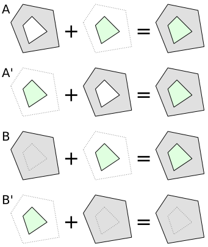

# Rendering

If you look at the [comparison map](http://area.jochentopf.com/map/) you'll
notice that many *old style* multipolygons seem to be rendered okay even in
the map that ignores *old style* multipolygons. This has something to do with
rendering order.

## Rendering order

Look at the following examples. There are two multipolygons. One (gray) area
with a hole in the middle and a (green) area that fits inside this hole.
In the first two cases (A and A') the first area is correctly modelled with
a hole, in the second two cases (B and B') the first area is not correctly
modelled, there is no hole there.

Correctly tagged multipolygons (A and A') will always show up on the map
correctly. It doesn't matter if the gray area is rendered first (A) or if the
green area is rendered first (A'), you will always get the correct result.

In the other case it depends on whether the gray area is rendered first and
then the green on top of it (B, correct result) or the other way around (B',
grey area hides green area).

The main OSM style orders multipolygons by area before drawing them.
Multipolygons with larger area are drawn first. So wrong tagging will often
not be visible on the map.

## Why is this important for the *old style* vs. *new style* tagging?

A multipolygon relation with only a single outer way tagged in the *old style*
(ie. tags on the way) will often appear to be correct on the map. The relation
doesn't have any tags, so it will not be rendered at all. The outer ring has
the tags and, because it is closed, will be detected as a multipolygon and is
rendered. Then the inner ring will be detected as a multipolygon in its own
right and rendered, too. Because the outer ring is larger than the inner ring,
it will be rendered first. So everything appears to be okay, even though the
data is not.

All this only works because of the defined rendering order. And we should not
rely on the ordering of the multipolygons before rendering, because not every
map will do it this way. And the ordering takes time and effort, so we should
not require it.

